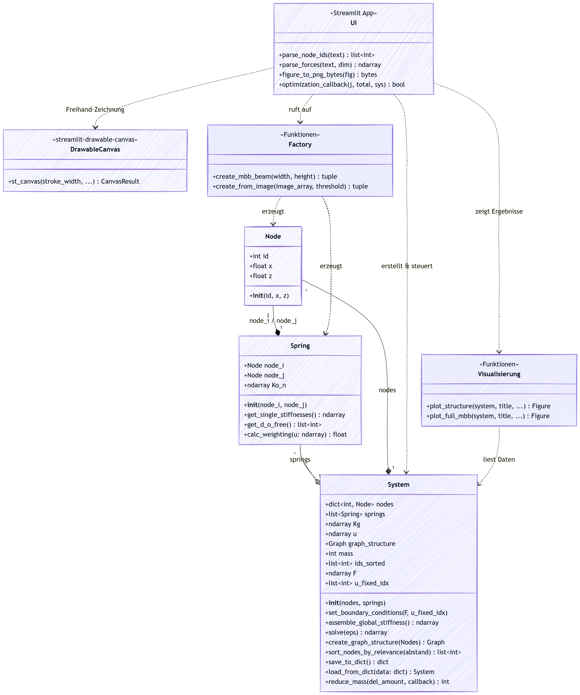

# 2D Topologieoptimierer für Fachwerke

Dieses Projekt implementiert einen 2D-Topologieoptimierer, der die **Ground Structure Methode** nutzt, um optimale Fachwerkstrukturen zu finden. Über ein interaktives Web-Interface (Streamlit) können Lastfälle und Randbedingungen definiert in der UI gezeichnet oder als Bild importiert werden zudem kann der Optimierungsprozess live verfolgt werden.

## Beschreibung

Das Programm generiert zunächst eine dichte Grundstruktur aus Knoten und Federelementen, die ein Gitter bilden. Ziel ist es, ineffizientes Material zu entfernen, bis nur noch die lastabtragende Struktur übrig bleibt.

**Der Optimierungsprozess im Detail:**

1.  **FEM-Analyse (Systemlöser):**
    Berechnung der Verschiebungen ($u$) und Kräfte im aktuellen System mittels der direkten Steifigkeitsmethode. Es wird das lineare Gleichungssystem $K \cdot u = F$ gelöst.

2.  **Sensitivitätsanalyse:**
    Berechnung der Dehnungsenergie für jedes Federelement. Elemente mit hoher Dehnungsenergie sind essenziell für die Struktur.

3.  **Filterung & Knotenbewertung:**
    Um "Checkerboard-Muster" und instabile Einzelstränge zu vermeiden, wird ein **Sensitivitätsfilter** angewendet. Die Relevanz eines Knotens hängt nicht nur von ihm selbst ab, sondern auch von der Energie seiner Nachbarn (gewichteter Durchschnitt basierend auf dem geometrischen Abstand).

4.  **Iterative Reduktion:**
    Knoten mit dem geringsten Energiebeitrag werden nacheinander aus dem System entfernt.

5.  **Stabilitäts- & Konnektivitäts-Checks:**
    Vor jedem Löschen prüft das System zwei Bedingungen:
    *   **Pfad-Check:** Bleibt mittels `networkx` ein Pfad zwischen Lasteinleitung und Lager bestehen?
    *   **Kinematik-Check:** Hat ein Knoten noch genügend Anbindungen (Grad $\ge 3$), um stabil zu sein?
    Ist eine Bedingung verletzt, wird der Knoten behalten und der nächst-schlechteste Kandidat geprüft.

## Anforderungen

Die Anwendung ist in Python 3 geschrieben. Die Abhängigkeiten finden Sie in `requirements.txt`.
Hauptsächlich werden verwendet:

*   `numpy` (Numerik, Lösung linearer Gleichungssysteme)
*   `streamlit` (Frontend & Visualisierung)
    `streamlit-drawable-canvas` (Zeichnen in der UI)
*   `networkx` (Graphentheorie für Konnektivitäts-Checks)
*   `matplotlib` (Plotting der Fachwerke & Heatmaps)
*   `pillow` (Bildverarbeitung für den Import von Strukturen)

## Installation

Installieren Sie die Abhängigkeiten mit folgendem Befehl:

```bash
pip install -r requirements.txt
```

## Nutzung

Starten Sie die Anwendung über das Terminal:

```bash
streamlit run ui.py
```

Das Web-Interface öffnet sich automatisch im Browser. Dort können Sie:
1.  Ein Standard-Problem (MBB-Balken) konfigurieren.
2.  Eigene Strukturen per **Freihand-Zeichnung** direkt im Browser skizzieren dafür ist es notwendig die Seitenleiste etwas zu vergrößern um die Zeichenfläche zu vergrößern.
3.  Eigene Strukturen über schwarz-weiß Bilder importieren (schwarz = Material).
4.  Den Optimierungsprozess starten und live beobachten, wie sich die Struktur entwickelt.

## Projektstruktur

Der Code wurde modularisiert, um die Wartbarkeit zu verbessern:

*   **`ui.py` (Frontend)**:
    Beinhaltet die Streamlit-Oberfläche. Hier werden Benutzereingaben verarbeitet, der Session-State verwaltet und die Plots dargestellt.
*   **`system.py` (Kernlogik)**:
    Hier liegt die gesamte "Intelligenz" des Programms.
    *   `Node` & `Spring`: Datenklassen für die Elemente.
    *   `System`: Klasse für die FEM-Berechnung (`assemble_global_stiffness`, `solve`), die Verwaltung der Topologie und die Optimierungsschleife (`reduce_mass`).
    *   `plot_structure`: Funktionen zur Visualisierung mittels Matplotlib (inkl. Heatmaps).
Im folgenden UML-Diagramm ist die Struktur des Codes dargestellt:



## Quellen & Referenzen

Die Implementierung basiert auf Methoden der Strukturmechanik und Informatik. Hier sind Quellen, die für das Schreiben des Codes geholfen haben

1.  **Direct Stiffness Method (FEM)**
    *   *Relevanz:* Kernstück von `system.py` zur Berechnung von $K$ und $u$.
    *   *Quelle:* [Wikipedia: Direct Stiffness Method](https://en.wikipedia.org/wiki/Direct_stiffness_method) und Hilfestellungen vom Skript

2.  **Sensitivitätsfilterung (Mesh-Independency)**
    *   *Relevanz:* In `sort_nodes_by_relevance` nutzen wir eine gewichtete Nachbarschaftssuche. Dies ist angelehnt an Standardfilter in der Topologieoptimierung, um nummerische Instabilitäten zu glätten.
    *   *Quelle:* [Sigmund, O., & Petersson, J. (1998). Numerical instabilities in topology optimization.](https://link.springer.com/article/10.1007/BF01214002)

3.  **Graphentheorie (Konnektivität)**
    *   *Relevanz:* Die Funktion `nx.has_path` und `nx.degree` verhindern, dass die Struktur während der Optimierung zerfällt.
    *   *Quelle:* [NetworkX Documentation - Connectivity](https://networkx.org/documentation/stable/reference/algorithms/component.html)

4.  **Matplotlib Colormaps & Plotting**
    *   *Relevanz:* Darstellung der Spannungsverteilung ("Heatmap") in `plot_structure`.
    *   *Quelle:* [Matplotlib Tutorials - Colormaps](https://matplotlib.org/stable/tutorials/colors/colormaps.html)

5.  **Python Scientific Stack**
    *   *Streamlit:* [Docs](https://docs.streamlit.io/) für das UI.
    *   *NumPy:* [Linalg.solve](https://numpy.org/doc/stable/reference/routines.linalg.html) zum Lösen der Gleichungssysteme.